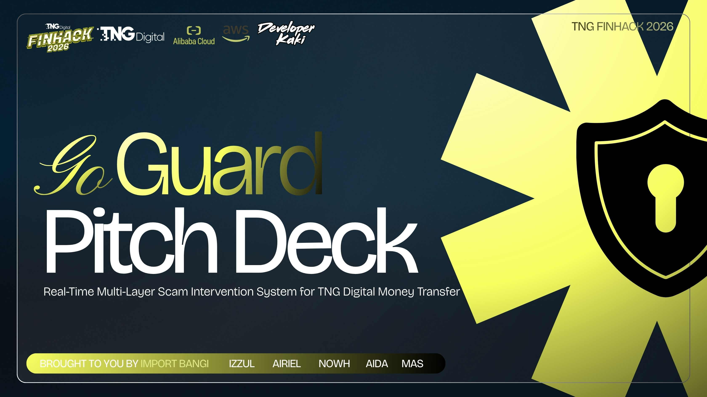

# 🛡️ GoGuard — Real-Time Scam Intervention System

> Flutter e-wallet app with AI-powered scam detection, built for TNG Digital FINHACK 2026.
> Selected Top 300 nationally — only UKM team competing.



## 📱 Demo


**Test Login:**
- Email: `demo@goguard.com`
- Password: `demo123`

---

## 🧠 How It Works


GoGuard uses a **hybrid AI risk engine** combining two models:

| Model | Role | Weight |
|-------|------|--------|
| GNN (Graph Neural Network) | Checks recipient against scam network graph | 50% |
| XGBoost | Analyses transfer amount, time & velocity | 50% |

**Risk Levels:**
- 🟢 LOW — score < 0.4 → Transfer proceeds normally
- 🟡 MEDIUM — score < 0.7 → Warning shown
- 🔴 HIGH — score ≥ 0.7 → 60-second cooldown enforced

---

## ✨ Features


- **Real-Time Scam Detection** — AI analysis on every transaction
- **LLM Explanation Layer** — Human-readable fraud reasoning per flagged transfer
- **60-Second Breathing Room** — HIGH risk transfers require cooldown before proceeding
- **Scammer Warning List** — Community-powered database with live phone lookup
- **Trusted Contacts** — Whitelist verified contacts to skip scam check
- **Real-Time Balance** — Updates instantly after every transfer

---

## 🖼️ Screenshots

| Home Dashboard | Transfer Flow | Risk Warning |
|---|---|---|
|  |  |  |

| LOW Risk | HIGH Risk | LLM Explanation |
|---|---|---|
|  |  |  |

---

## 🛠️ Tech Stack

| Layer | Technology |
|-------|------------|
| Frontend | Flutter (Web) |
| State Management | Flutter BLoC |
| Authentication | AWS Amplify + Cognito |
| AI Backend | Alibaba Cloud (GNN + XGBoost + LLM) |
| Hosting | AWS Amplify Console |

---

## 🚀 Run Locally

```bash
# Install dependencies
flutter pub get

# Run on Chrome
flutter run -d chrome

# Build for web
flutter build web --release
```

---

## 👩‍💻 Developer

**Nurul Aida Binti Jamil** — Backend Lead
[LinkedIn](https://linkedin.com/in/aidajamil) · [GitHub](https://github.com/aidajamil21)
